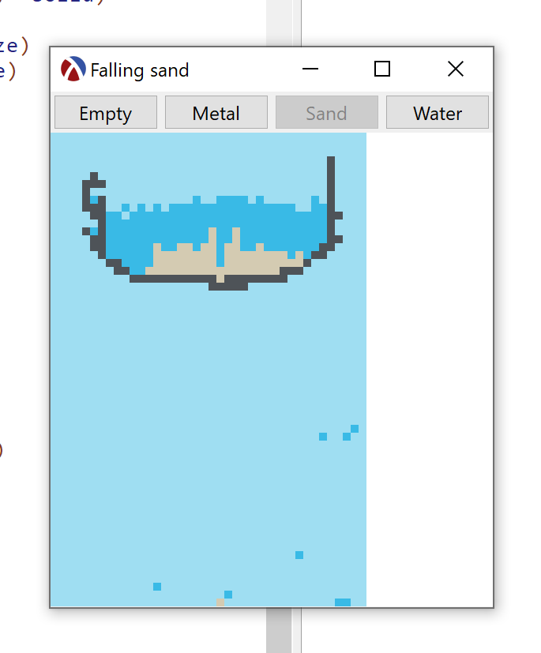

# falling-sand

[Falling Sand](http://nifty.stanford.edu/2017/feinberg-falling-sand/) but in Racket.

**main.rkt** renders the thing and edits the thing from mouse interactions.

**particle.rkt** defines the particles' names, looks, and behaviours and also abstracts them.

**sim.rkt** is my first attempt for simulating the sand using weird recursion to avoid using `set!`

**sim-mutable-pairs.rkt** is `sim.rkt` but faster and uses mutable pairs.

